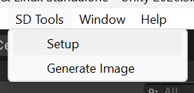
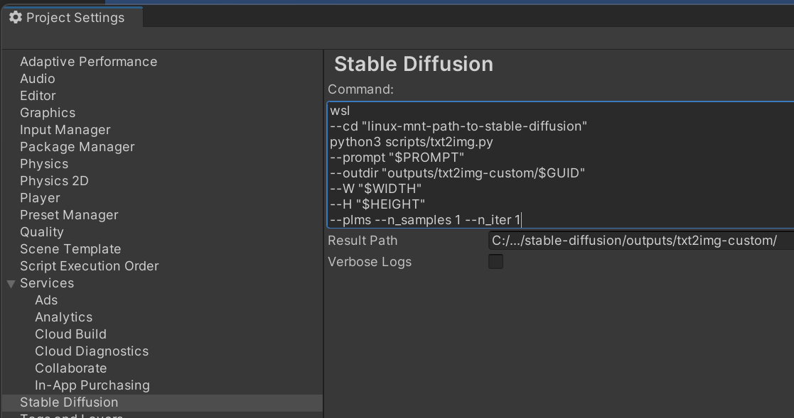
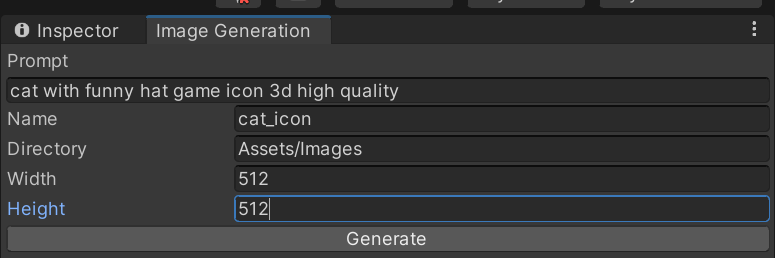
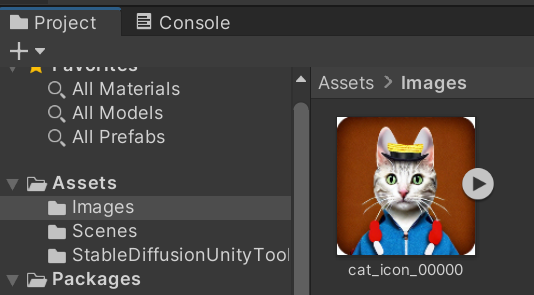

# Stable Diffusion Unity Tools

## Summary

Editor utility to generate assets in Unity Editor via self-hosted & managed Stable Diffusion installations

## Installation

1) Setup Stable Diffusion on your local machine - https://github.com/CompVis/stable-diffusion (skip if you will use managed services)
2) Add package in Packages/manifest.json:
   ```
    "com.konh.stable-diffusion-unity-tools": "https://github.com/KonH/StableDiffusionUnityTools.git?path=Packages/com.konh.stable-diffusion-unity-tools"
   ```
3) Click **SD Tools/Setup**, it creates settings file<br/>

4) Open settings at **Edit/Project Settings/Stable Diffusion** and configure:
   - **Command** - command to execute stable diffusion:
      - Should contain required placeholders: `$PROMPT` for generation prompt, `$OUT_DIR` for destination directory, `$WIDTH` and `$HEIGHT` for image dimensions (these arguments assigned at generation process)
      - Could be multiline for better usability, line breaks are ignored
      - Windows WSL example (in that case paths should be related to Linux file system): `wsl
        --cd "linux-mnt-path-to-stable-diffusion"
        python3 scripts/txt2img.py
        --prompt "$PROMPT" --plms --n_samples 1 --n_iter 1 --outdir "outputs/txt2img-custom/$GUID"`
      - If you want to use managed service - write custom script which communicate with it and store results on file system in txt2img.py compatible format
   - **ResultPath** - full path to directory with generated files on local file system (in case of WSL - Windows host machine)

5) Additionally, you could add **Assets/StableDiffusionUnityTools** to .gitignore (it's related to current machine, unfortunately we can't use UserSettings for that)

## Asset file generation

Now you can use **SD Tools/Generate Image** to generate images, it provide you ability to tweak settings for next generation:
 - Required settings: **Prompt**, **Directory**, **Width**, **Height**
 - Optional settings: **Name** (if not assigned, GUID is used)


When generation finished, you will see result in given directory
